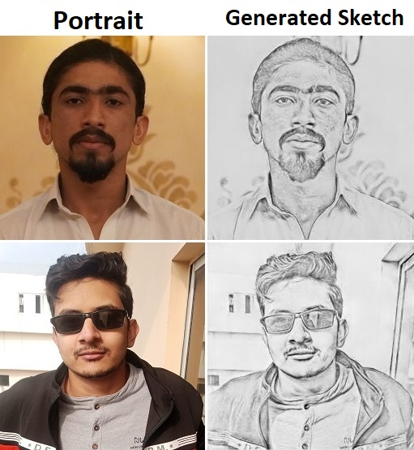

<h1 align="center">SketchGEN: A Pix2Pix Based Portrait to Pencil Sketch Converter</h1>

Welcome to the Portrait to SketchGAN! This project leverages the power of pix2pix, a Generative Adversarial Network (GAN) framework, to convert portrait images into sketches. 

## Table of Contents
- [Introduction](#introduction)
- [Features](#features)
- [Installation](#installation)
- [Usage](#usage)
- [Examples](#examples)
- [Contributing](#contributing)

## Introduction

This project is designed to take a portrait image as input and produce a sketch version of the image as output. The core technology behind this transformation is the pix2pix GAN, which is capable of learning the mapping from input images to output images, allowing it to create realistic sketches from portraits.

## Features

- **Easy Conversion**: Simple and efficient conversion of portrait images to sketches.
- **Open Source**: The project is open-source and can be freely used and modified.

## Installation

To install and run this project, follow these steps:

1. **Clone the Repository**:
   ```sh
   git clone https://github.com/yourusername/portrait-to-sketch.git
   cd portrait-to-sketch

2. **Install Dependencies**
   ```sh
   pip install requirements.txt

## Usage
You can either train the model from scratch by running the train.py file or you can download the weights from <a href="#">this link</a> and get infrence by using get_infrence.py 

## Examples

Here are a few examples of input portraits and their corresponding sketch outputs generated by our model:

<div align="center">
    
</div>

## Contributing
-<a href="https://github.com/harrisrais">Haris Raees</a> 

